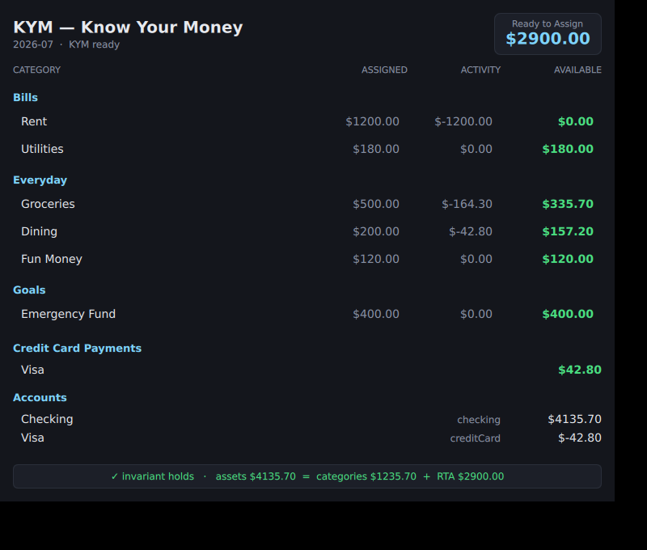

# KYM grid — standalone render preview

Renders the **actual budget grid QML** (identical layout to `../qml/Main.qml`) driven by the **actual C++ engine** (`../src/kym_engine.hpp`), outside the full Basecamp host — for producing a screenshot and iterating on the view.



## What this proves (and what it doesn't)

- **Proves:** the grid QML renders correctly and the numbers come from the real engine fold (`gen_budget.cpp` seeds the same demo budget as the module's `loadDemo()`), with the zero-based invariant holding on screen.
- **Does NOT replace** a full Basecamp-host render: here the view reads a static `budget.js` instead of the live `logos.module("kym")` replica, and there is no Delivery/IPC. Full-host verification via `logos-qt-mcp` is tracked in issue #1 (the inspector is a static lib compiled into the app, so it needs a Basecamp built with it).

## Regenerate

```sh
g++ -std=c++17 -I../src gen_budget.cpp -o /tmp/genbudget && /tmp/genbudget > budget.json
printf 'var data = %s;\n' "$(cat budget.json)" > budget.js
# render (nix Qt 6.9.2 + Xvfb + llvmpipe software GL); see the parent shell history for the full env
qml preview.qml   # with QT_QPA_PLATFORM=xcb LIBGL_ALWAYS_SOFTWARE=1 GALLIUM_DRIVER=llvmpipe under xvfb-run
```

> Note: currency is shown as `$` here; the product targets **CZK/EUR** — making the formatter currency-aware is a tracked follow-up.
